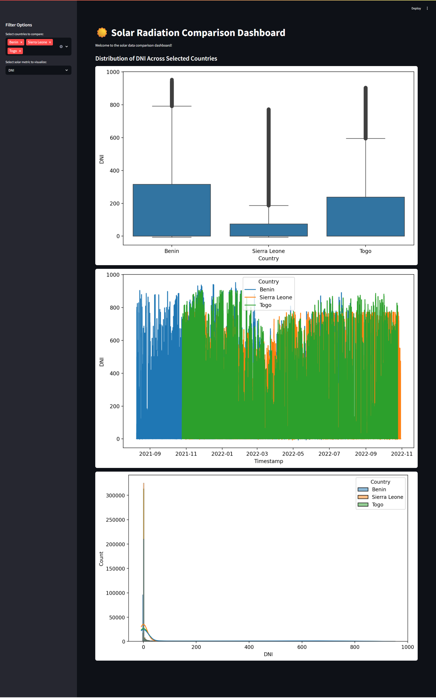

# ☀️ Kifiya Week 0 EDA Project

Welcome to the Benin EDA Project!  
This repository contains a comprehensive exploratory data analysis (EDA) of solar and meteorological data for Benin and other West African countries. The project focuses on data cleaning, outlier detection, visualization, and comparative analysis across countries.

---

## 📂 Project Directory Structure

```
kifiya-week-0/
│
├── app/
│   ├── __init__.py
│   ├── main.py
│   └── utils.py
│
├── data/
│   ├── benin-malanville.csv
│   ├── benin-malanville_clean.csv
│   └── ... (other country data)
│
├── notebooks/
│   ├── benin_eda.ipynb
│   ├── compare_countries.ipynb
│   ├── sierraleone-bumbuna_eda.ipynb
│   ├── togo-dapaong_qc.ipynb
│   └── README.md
│
├── requirements.txt
├── README.md
└── .github/
    └── workflows/
        └── ci.yml
```

---

## 🚀 What Has Been Done

- **Data Cleaning:**

  - Removed columns with excessive missing values.
  - Imputed missing values in key columns using the median.
  - Detected and removed outliers using Z-score.

- **Exploratory Data Analysis:**

  - Visualized time series, distributions, and correlations for solar and meteorological variables.
  - Created wind rose plots, histograms, and bubble charts.
  - Compared solar potential (GHI, DNI, DHI) across multiple countries using boxplots and summary tables.
  - Performed statistical tests (Kruskal-Wallis) to assess differences between countries.

- **Automation:**
  - Added a GitHub Actions workflow for CI to check environment setup and dependencies.

---

## 🖼️ Screenshots



_You can add your own screenshots in `notebooks/screenshots/` for more visual context!_

---

## 🛠️ Setup Instructions

### 1. Clone the Repository

```bash
git clone https://github.com/your-username/kifiya-week-0.git
cd kifiya-week-0
```

### 2. Create a Virtual Environment (Recommended)

**Using `venv`:**

```bash
python -m venv venv
```

Activate the environment:

- On Windows:
  ```bash
  venv\Scripts\activate
  ```
- On macOS/Linux:
  ```bash
  source venv/bin/activate
  ```

### 3. Install Dependencies

```bash
pip install -r requirements.txt
```

Or, if you don’t have a `requirements.txt`, install the main dependencies:

```bash
pip install pandas numpy matplotlib seaborn scipy
```

### 4. (Optional) Using Conda

```bash
conda create -n benin-eda python=3.11
conda activate benin-eda
pip install -r requirements.txt
```

### 5. Verify Installation

```bash
python --version
pip list
```

### 6. Run the Notebooks

Open Jupyter Notebook or VS Code and run `notebooks/benin_eda.ipynb` or `notebooks/compare_countries.ipynb` step by step.

---

## 📊 Results & Insights

- **Cleaned and preprocessed datasets** for Benin and other countries.
- **Visual insights** into solar and meteorological patterns.
- **Comparative analysis** of solar potential across West African countries.
- **Statistical validation** of differences in solar resources.

---

## 🤝 Contributing

Feel free to fork the repo, open issues, or submit pull requests!

---

**Tip:**  
If you add or update packages, run `pip freeze > requirements.txt` to update your dependency list.

---
